<div align="center">
  <picture>
    <source media="(max-width: 600px)" srcset="./assets/profile-hero-mobile.svg" />
    
  </picture>
</div>

<div align="center">
  <a href="#about">About</a>&nbsp;&nbsp;•&nbsp;&nbsp;
  <a href="#toolbox">Toolbox</a>&nbsp;&nbsp;•&nbsp;&nbsp;
  <a href="#current-focus">Current focus</a>&nbsp;&nbsp;•&nbsp;&nbsp;
  <a href="#connect">Connect</a>
</div>

<br />

## About

I’m a software engineer who enjoys turning complex requirements into dependable, maintainable products. My core work lives in the PHP and Laravel ecosystem, with C++ and Go sharpening how I think about performance, concurrency, and systems design.

I care about clear architecture, practical solutions, and software that remains pleasant to work on after it ships.

## Toolbox

<div align="left">
  
  
  
  
  
  
</div>

## Current focus

```text
01  Building robust web platforms with PHP and Laravel
02  Exploring concurrency and service design with Go
03  Crafting performance-minded systems with C++
04  Learning in public and contributing where I can
```

## GitHub activity

<div align="center">
  <picture>
    <source media="(prefers-color-scheme: dark)" srcset="https://github-readme-stats.vercel.app/api?username=ahmmeddd&show_icons=true&hide_border=true&bg_color=070B14&title_color=B8F116&text_color=DCE2EC&icon_color=2F6BFF" />
    <source media="(prefers-color-scheme: light)" srcset="https://github-readme-stats.vercel.app/api?username=ahmmeddd&show_icons=true&hide_border=true&bg_color=FFFFFF&title_color=1F5EFF&text_color=182033&icon_color=73A600" />
    
  </picture>
  <picture>
    <source media="(prefers-color-scheme: dark)" srcset="https://streak-stats.demolab.com?user=ahmmeddd&hide_border=true&background=070B14&ring=2F6BFF&fire=B8F116&currStreakLabel=B8F116&sideLabels=DCE2EC&dates=8793A8&currStreakNum=F5F7FB&sideNums=F5F7FB" />
    <source media="(prefers-color-scheme: light)" srcset="https://streak-stats.demolab.com?user=ahmmeddd&hide_border=true&background=FFFFFF&ring=1F5EFF&fire=73A600&currStreakLabel=73A600&sideLabels=182033&dates=59657A&currStreakNum=101828&sideNums=101828" />
    
  </picture>
</div>

## Connect

I’m open to thoughtful conversations, collaborations, and interesting engineering problems.

<div align="left">
  <a href="https://github.com/ahmmeddd"></a>
  <a href="https://www.linkedin.com/in/ahmed-hassan-23b59b279/"></a>
  <a href="mailto:ahmed724462@gmail.com"></a>
</div>

<br />

<div align="center">
  <sub>Build with care. Optimize with purpose. Ship what matters.</sub>
</div>
